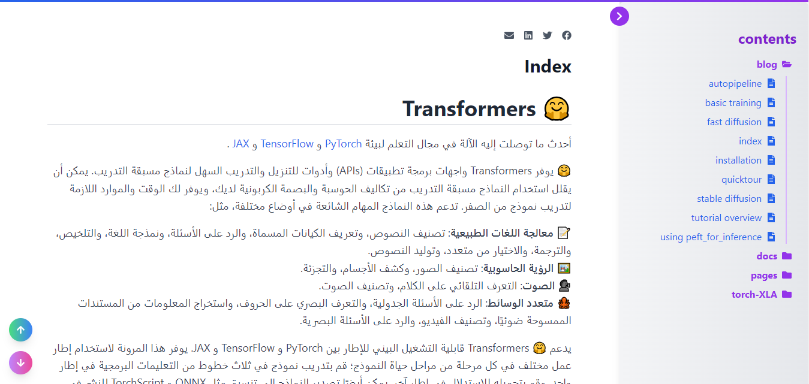
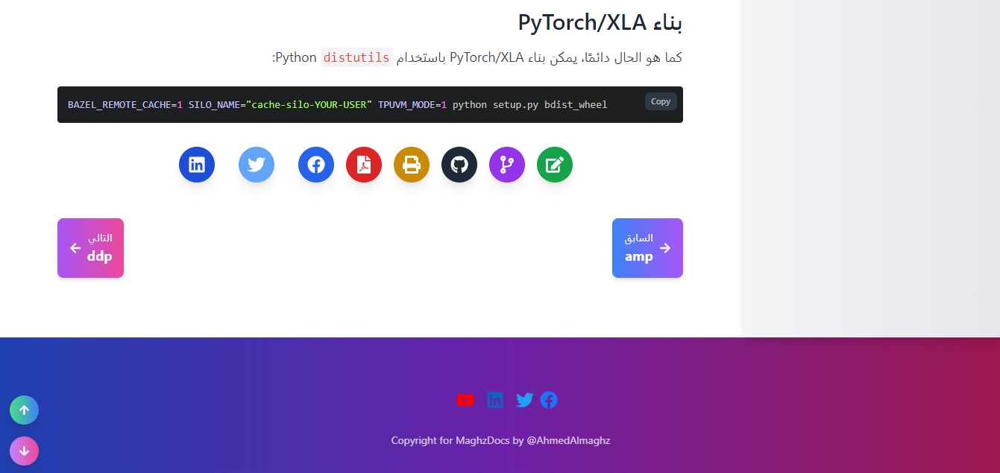

# Maghz Docs
هو عبارة عن تطبيق React & TailwindCSS مفتوح المصدر يقوم ببناء موقع ويب يمكن إستخدامه كمدونة أو توثيق .

الموقع يقوم بقراءة صفحاته بشكل آلي من ملفات Markdown .

يمكن إستضافته على مزودات الخدمات المجانية مثل firebase, netfily, vercal, github pages,... وغيرها.

سريع وخفيف وأنيق وعملي.

## كيف يعمل
1- انسخ ملفات `*.md` إلى مجلد `public/markdown/` في مجلد التطبيق.

2- نفذ أمر بناء التطبيق `npm run build`.

3- إرفع ملفاتك إلى الإستضافة الخاصة بك. 

 مبروك أصبح موقعك جاهز !!!


## Getting Started البدء
### انسخ المستودع

```bash
git clone https://github.com/AhmedAlmaghz/MaghzDocs.git

cd MaghzDocs
```
### تثبيت التبعيات

```bash
npm install

```
### انسخ ملفات md إلى المجلد `public/markdown`

Copy Files to `public/markdown` folder

### تشغيل التطبيق في وضع التطوير

```bash
npm run dev
```
إفتح الرابط : [http://localhost:3000](http://localhost:3000)


## Build Application  بناء التطبيق للإنتاج

```bash
npm run build
```

## إنشاء ملف قائمة صفحات الموقع
طبعا عندما تقوم بتنفيذ الأمر `npm run build` يقوم التطبيق ببناء ملف `public/markdown/structure.json` بشكل آلي مع الإنشاء إعتماداً على هيكل الملفات والمجلدات في المجلد الرئيسي `public/markdown`

إذا اردت بناء ملف مخطط الصفحات `public/markdown/structure.json` بشكل منفصل دون بناء التطبيق نفذ الامر التالي:

```bash
npm run generate-index
```

تستطيع تحرير الملف `public/markdown/structure.json` يدوياً وتغيير هيكل روابط الموقع حسب ما تريد دون الإعتماد على هيكل الملفات والمجلدات في مجلد `markdown` 
في الملف `public/markdown/structure.json` يتم إستخدام اسم الملف ومساره تسستطيع تحريرة وتغيير أسماء الروابط كما تريد دون الإعتماد على اسم الملف الافتراضي وكذلك تغيير هيكل خريطة الموقع فروابط الموقع يتم قراتها من الملف `public/markdown/structure.json` اسم الرابط وعنوان الرابط وكذلك المجلد عبارة عن التصنيف الرئيسي للملفات التي بداخله

## Demo شاهد
[Demo MaghzDocs](https://transformers.web.app)



