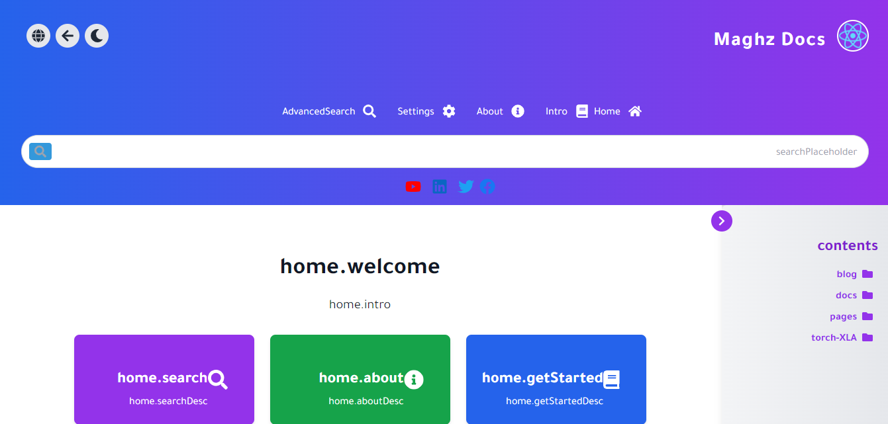

### Maghz Docs: توثيق شامل

**Maghz Docs** هو تطبيق مفتوح المصدر بالكامل مبني باستخدام **React** و **TailwindCSS**، يتيح لك إنشاء موقع ويب سريع الاستجابة وسهل الاستخدام، مثالي للتدوين أو التوثيق. يقوم التطبيق بإنشاء صفحات ويب بشكل تلقائي من ملفات Markdown، مما يوفر لك حلاً بسيطًا وفعالًا لإدارة المحتوى.

تم تحسين التطبيق للنشر على منصات الاستضافة المجانية مثل **Firebase**، **Netlify**، **Vercel**، **GitHub Pages** وغيرها، مما يضمن لك المرونة وسهولة الاستخدام.

### الميزات الرئيسية:
- **توليد الصفحات تلقائيًا**: يقوم بقراءة المحتوى من ملفات Markdown وبناء موقع ويب منظم.
- **خفيف وسريع**: تم تحسينه للأداء وتجربة المستخدم.
- **تصميم أنيق**: يعتمد على TailwindCSS للحصول على تصميم عصري وقابل للتخصيص.
- **استضافة مرنة**: يمكن نشره بسهولة على العديد من المنصات المجانية مثل Firebase و Netlify و GitHub Pages.

---

## كيف يعمل:
اتبع هذه الخطوات البسيطة لإنشاء موقع الويب الخاص بك باستخدام Maghz Docs:

1. انسخ ملفات Markdown (`*.md`) إلى مجلد `public/markdown/` داخل دليل التطبيق.
2. قم ببناء التطبيق باستخدام الأمر التالي:
   ```bash
   npm run build
   ```
3. ارفع الملفات الناتجة إلى خدمة الاستضافة التي تفضلها.

   **تهانينا! أصبح موقعك جاهزًا للنشر!**

---

## البدء

### 1. استنساخ المستودع
ابدأ باستنساخ مستودع Maghz Docs إلى جهازك المحلي:

```bash
git clone https://github.com/AhmedAlmaghz/MaghzDocs.git
cd MaghzDocs
```

### 2. تثبيت التبعيات
بعد الاستنساخ، قم بتثبيت التبعيات اللازمة باستخدام الأمر التالي:

```bash
npm install
```

### 3. إضافة ملفات Markdown الخاصة بك
ضع ملفات Markdown (`*.md`) في مجلد `public/markdown`. سيتم استخدام هذه الملفات لإنشاء صفحات الموقع.

### 4. تشغيل التطبيق في وضع التطوير
لمعاينة التغييرات والعمل في وضع التطوير، استخدم الأمر التالي:

```bash
npm run dev
```
ثم افتح [http://localhost:3000](http://localhost:3000) في المتصفح لمشاهدة التطبيق يعمل محليًا.

---

## بناء التطبيق للإنتاج

عندما تكون جاهزًا لنشر موقعك، قم ببناء النسخة المخصصة للإنتاج باستخدام الأمر:

```bash
npm run build
```

سيتم إنشاء ملفات ثابتة محسّنة يمكن رفعها إلى منصة الاستضافة الخاصة بك.

---

## تخصيص هيكل الموقع

عند تنفيذ أمر البناء، يقوم التطبيق بإنشاء ملف `structure.json` تلقائيًا داخل `public/markdown/`. يحدد هذا الملف هيكل موقعك بناءً على توزيع المجلدات والملفات في دليل `public/markdown`.

إذا كنت ترغب في إنشاء ملف `structure.json` يدويًا دون بناء التطبيق بالكامل، نفذ الأمر التالي:

```bash
npm run generate-index
```

كما يمكنك تحرير ملف `structure.json` يدويًا لتخصيص التنقل بين صفحات الموقع وهيكل الفئات والروابط دون الحاجة إلى تغيير هيكل الملفات الفعلي.

### مرونة ملف Structure.json:
- **روابط قابلة للتخصيص**: يمكنك تعديل روابط الصفحات وأسمائها المعروضة دون تغيير أسماء الملفات.
- **هيكل ديناميكي**: نظم هيكل الموقع عن طريق تحرير الفئات الفرعية والصفحات داخل `structure.json`، مما يمنحك التحكم الكامل في كيفية عرض المحتوى.

---

## عرض حي

هل ترغب في رؤية Maghz Docs قيد العمل؟ تحقق من العرض الحي:

[عرض حي لموقع MaghzDocs](https://transformers.web.app)

---

## لقطات الشاشة
إليك بعض لقطات الشاشة التي تعرض أناقة ووظائف Maghz Docs:




مع **Maghz Docs**، أصبح إنشاء موقع ويب بتصميم جميل ومحتوى غني أسهل من أي وقت مضى. ابدأ في بناء موقعك اليوم!